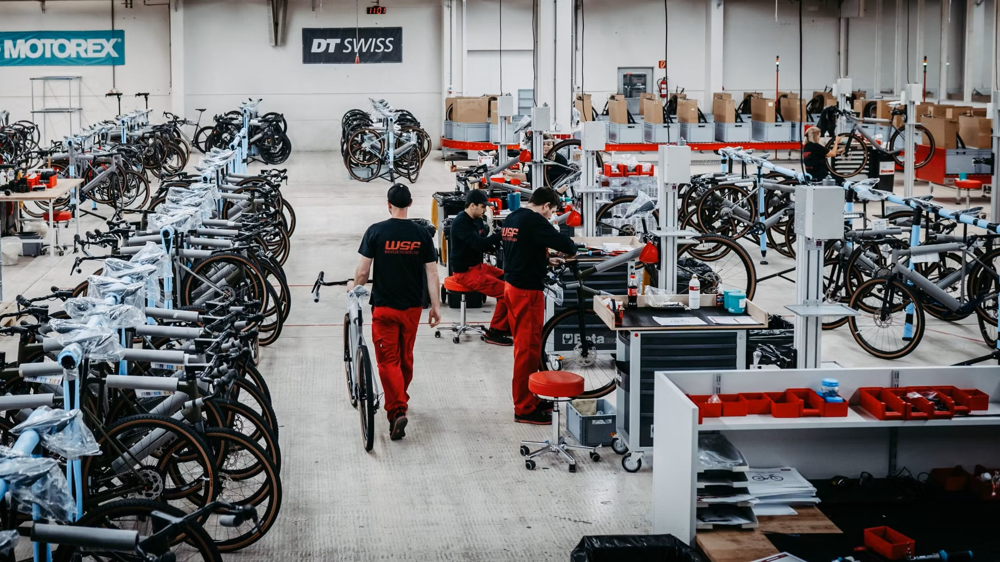
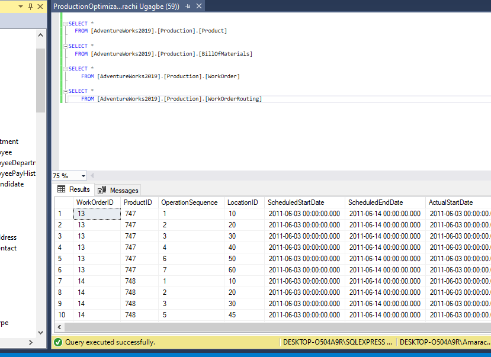
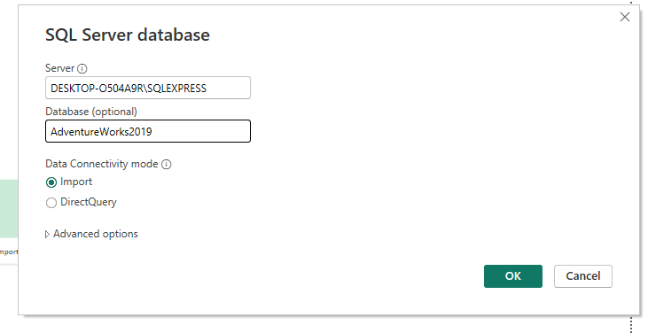
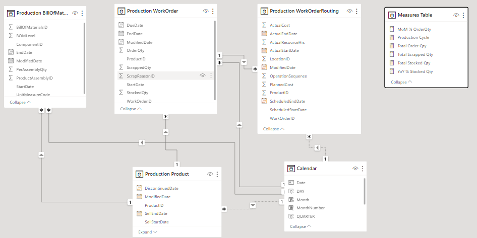
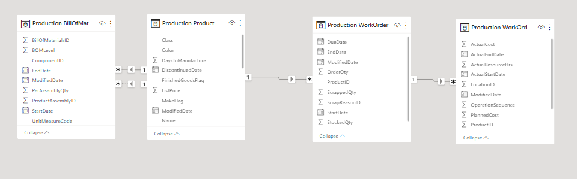
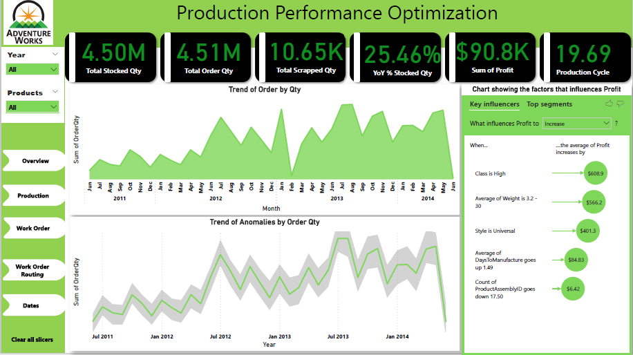
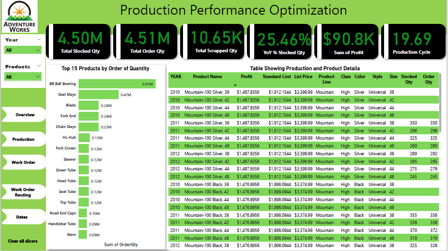
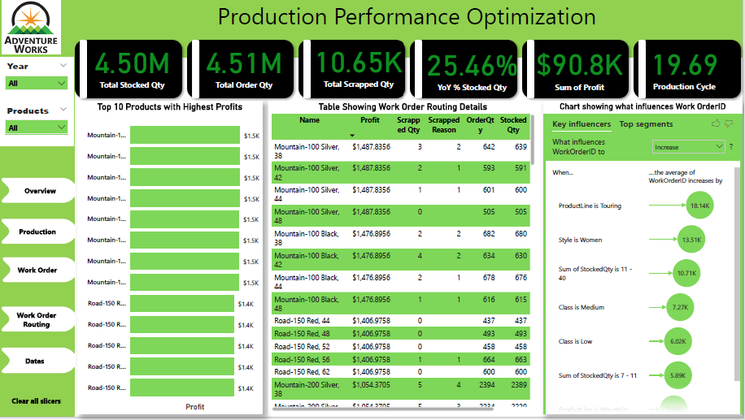
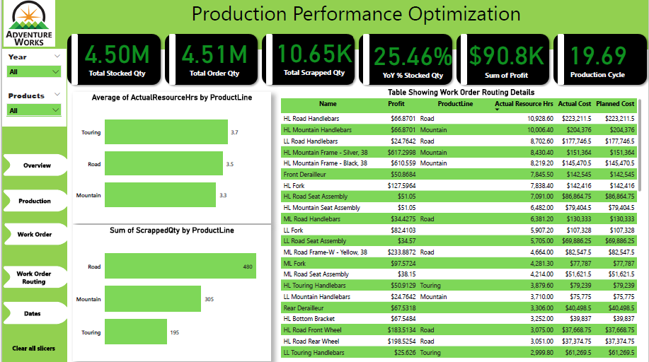
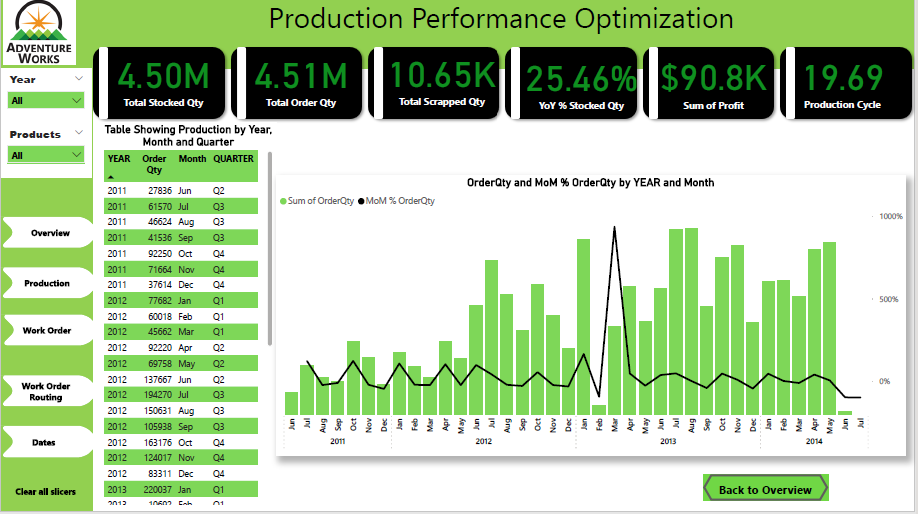

# Production-Performance Optimization


This is a project that shows my ability to use DAX Suggestion and other AI visuals for visualization in PowerBI. Although data is queried from the Adventure Works DW database. 
*(The  picture below is gotten from bike Europe website)*


## INTRODUCTION
It is important for any manufacturing company, to ensure efficient production performance in order to fulfill client demands, optimize resources, and maximize profits. This created the need for this analysis as it will offer significant insights into production performance across multiple dimensions

The Manufacturing Performance report can be used by the management team of the company to monitor and evaluate key production indicators, identify bottlenecks, and make data-driven choices to optimize operations. 


## PROBLEM STATEMENT
To provide insights into production performance by various categories and time periods.

## Skills and Concepts demonstrated:
 
 - SQL (Select, alias, Views)
 - PowerBI concepts like:
   - Creating key performance indicators (KPIs) and other business calculations using DAX Suggestion(CO-PILOT),
   - Data Modelling,
   - Measures,
   - filters,
   - tooltips, 
   - Page buttons,
   - Data Visualization
  
## Data Source:

The data used for this work is obtained from AdventureWorks2019 database tables - Production.Product, Production.BillOfMaterials, Production.WorkOrder, and  Production.WorkOrderRouting.
  - You can find a link to get started with installation and restoration of the database to your local machine.  [here:](https://youtu.be/VpY0Q_kwtIw) 
 ---

## Data Transformation:
- I wrote just a few queries in the Database on SQL Management Studio to view every detail in the tables. 


- Then I imported the tables into my PowerBI desktop app 


- I transformed the data in Power Query, checked for Colum quality, consistent or appropriate data types
- I began writing several Dax and creating measures and calculated columns to get the right metrics for the Inventory analysis.
- I also created the calendar table
- The queries I wrote on SQL are compiled and also uploaded here in this repository as "ProductionOptimizationQuery.sql"

The bulk of the transformation I did was in Production.Product table.
- I created a column known as 'Profit' in the Production.Product Table using this formula : Profit = CALCULATE(SUM('Production Product'[ListPrice]) - SUM('Production Product'[StandardCost]))
- I changed the letters in the 'Product Line' column, R  became  Road, M = Mountain, T = Touring and S became Standard
- I changed  the letters in the 'Class': H became High, M = Medium and L became  Low
- I also changed the 'Style' column details: U for  Universal, W for  Women and M for Men
The changes in the letters were effected as seen in the data dictionary.
---

## Data Modelling:
The intelligence in PowerBI makes it such that tables are automatically joined by creating relationships with them. However, as someone who understands the dataset and wants to get specific insights and information. I had to create other relationships and measures to enable me. so I did another model.

Created Model               |        Automated Model
:------------------------:  | :----------------------------------:
          | 

---
## Data Analysis
This project was a challenge and we were given some specifications.

Several expressions and functions were made to arrive at the desired KPI or Metrics. This was the main reason for this analysis as we were to use Copilot to generate DAX Expression according to the suggestions that it would give. Here is a list of some DAX expressions I used:

```
MoM % OrderQty = VAR __PREV_MONTH = CALCULATE(
    SUM(
        'Production WorkOrder'[OrderQty]
    ),
    DATEADD(
        'Calendar'[Date],
        -1,
        MONTH
    )
)
RETURN
    DIVIDE(
        SUM(
            'Production WorkOrder'[OrderQty]
        )
        - __PREV_MONTH,
        __PREV_MONTH
    )
```

```
Production Cycle = [Total Order Qty]/ SUM('Production WorkOrderRouting'[ActualResourceHrs])
```

```
YoY % Stocked Qty = VAR __PREV_YEAR = CALCULATE(
    SUM(
        'Production WorkOrder'[StockedQty]
    ),
    DATEADD(
        'Calendar'[Date],
        -1,
        YEAR
    )
)
RETURN
    DIVIDE(
        SUM(
            'Production WorkOrder'[StockedQty]
        )
        - __PREV_YEAR,
        __PREV_YEAR
    )
```
```
Total Stocked Qty = SUM(
    'Production WorkOrder'[StockedQty]
)
```

```
Total Scrapped Qty = SUM(
    'Production WorkOrder'[ScrappedQty]
)
```

```
Total Order Qty = SUM(
    'Production WorkOrder'[OrderQty]
)
```

## Data Visualization
The visualization consists of 5 pages named
- Overview
- Product
- Work Order
- Work Order routing
- Date

The features of the report are just a 5 paged report with filters for dates and products. It also contains KPIs that are consistent on all the pages.
The report can be interacted [here:](https://app.fabric.microsoft.com/view?r=eyJrIjoiOWQwM2UyM2MtN2RlMS00Yjk0LTg3NmItMzY3OTA3MjZkZTA4IiwidCI6IjY0NTI5N2QxLWVkNmMtNDk0Ni1iNzg1LTE1MTI5MThlYmU2YiJ9)


Here are the reports:
- Overview Page
  


- The Product page
  


- Work Order
  



- Work Order routing




- Date
  



## Insights
- The Company had a profit of an estimate of  $91,000.
- They had a total order quantity of 4.51 Million and a total stocked qty of 4.5 million.
- They had August 2013 as the month with the highest order quantity of 235,037.
- Profit increases when the product belongs to the High Class and also a Universal Style.
- The BB Ball Bearing had the highest order in quantity followed by Seat Stays.
- The products with the highest profit are the "Mountain-100 products" followed by the "Road-150 Red" Products.
- WorKOrderID increases when the Product line is "Touring" and the Style is Women.
- Touring had the highest actual hours used.
- Road has the highest amount of scrapped quantity.

## Limitation

I really do not know what happened between 2008 and 2011 and it is quite difficult to give a recommendation. Perhaps the data should be looked into for complete data that will help with more analysis.
Also, for some unknown reasons, the Product Line named "Standard" did not want to show on the visuals. I tried all I could. 


# Thank you for reading.

